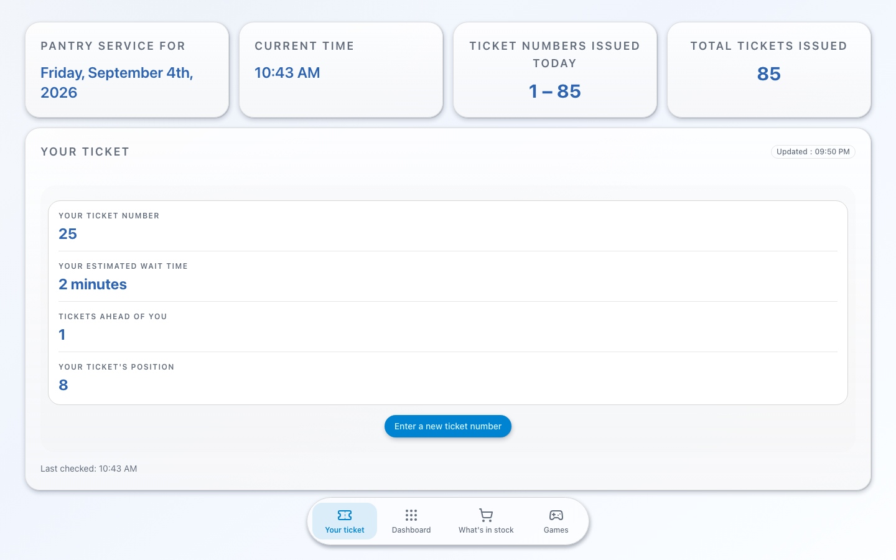
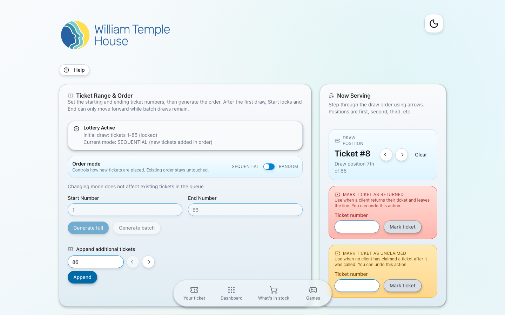
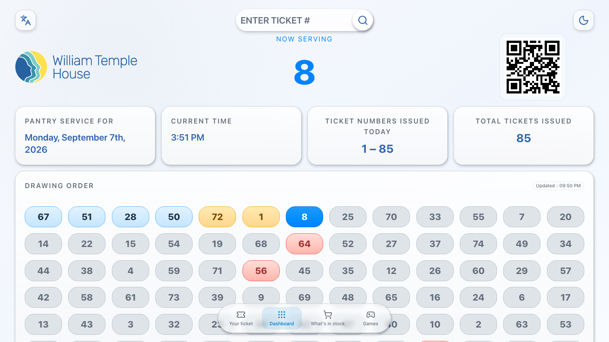
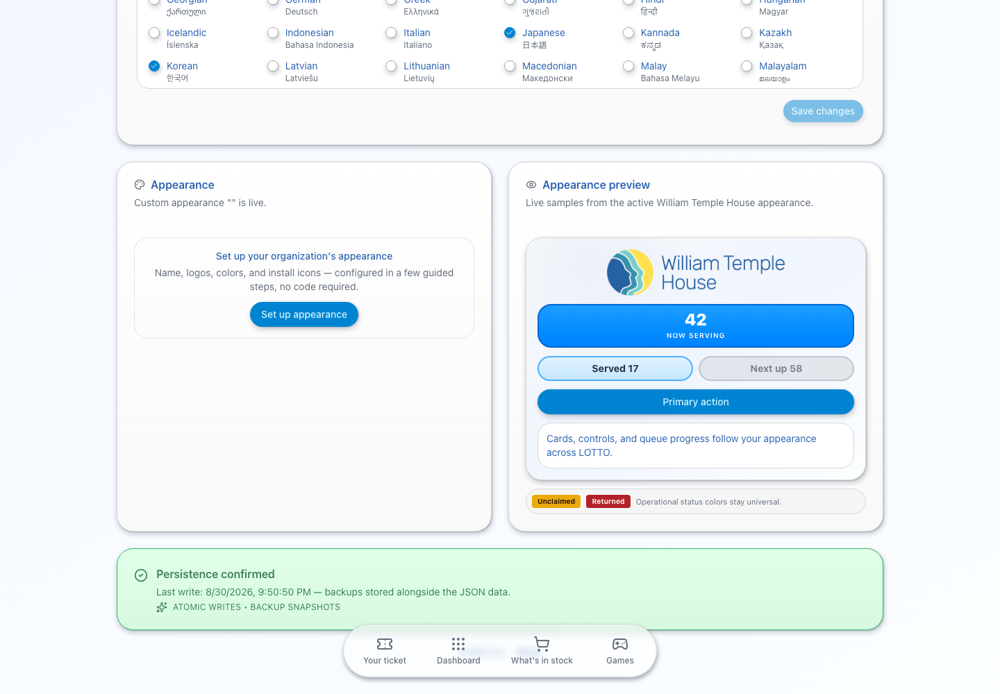
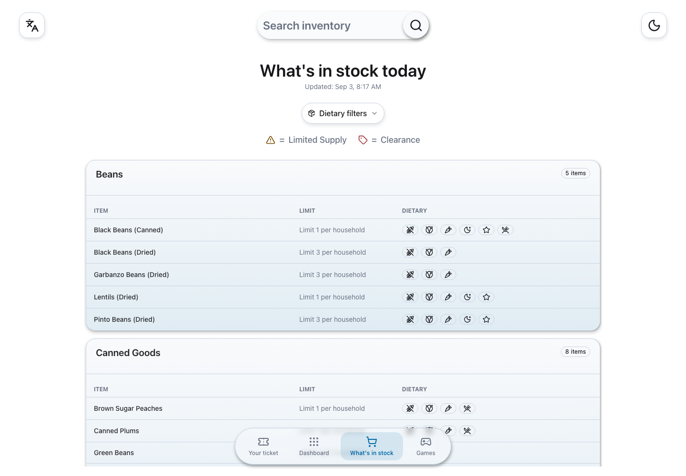
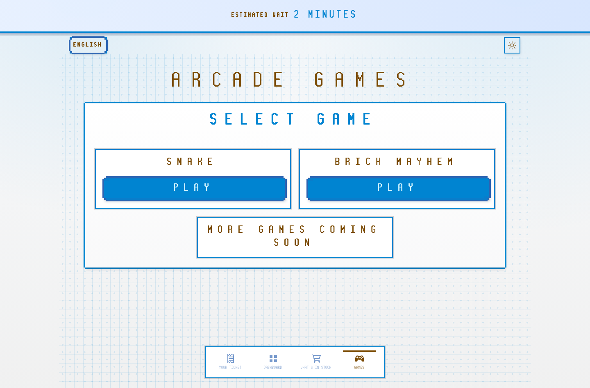
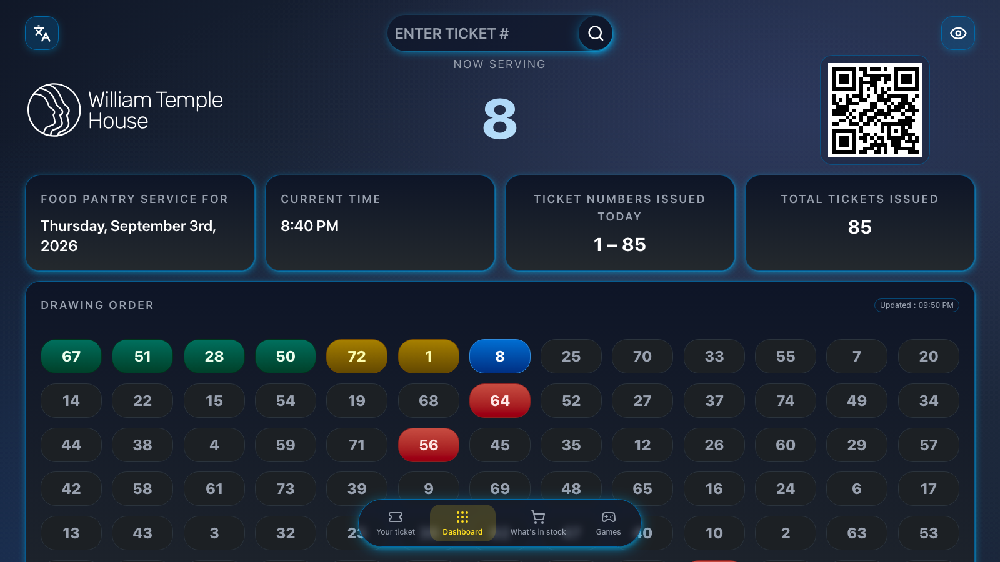
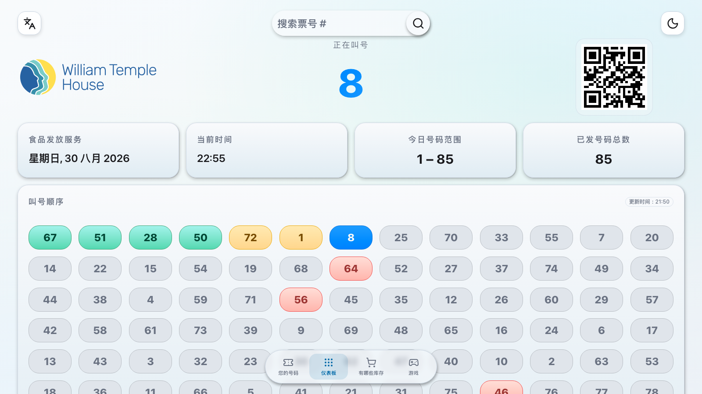
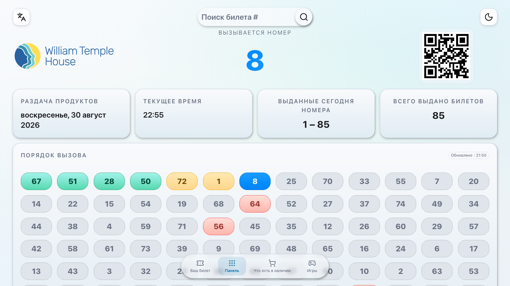
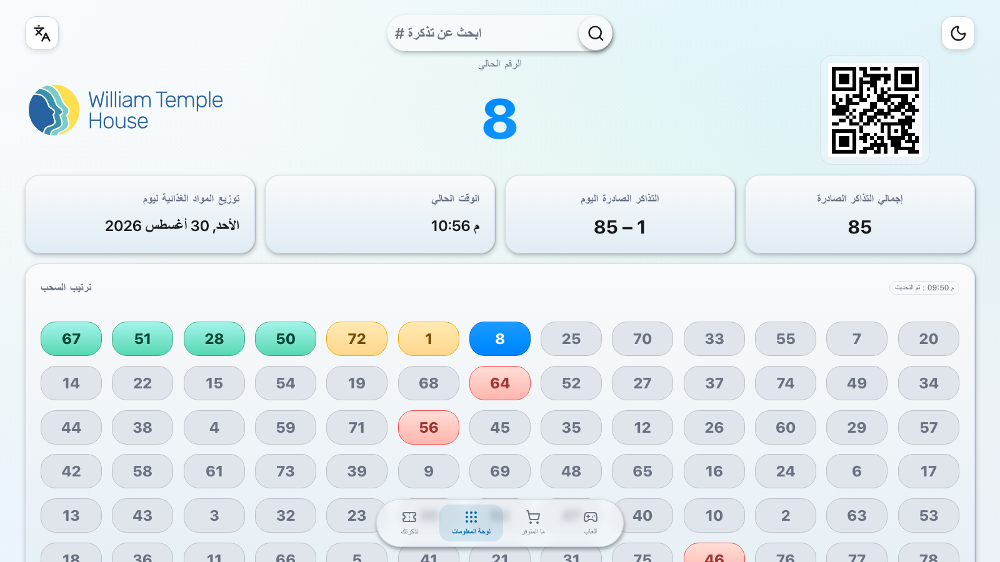

<p align="center">
  <a href="https://templepdx.com">
    <picture>
      <source media="(prefers-color-scheme: dark)" srcset="public/temple-logo-dark.svg">
      
    </picture>
  </a>
</p>

<p align="center"><em>A creation of <a href="https://templepdx.com">Temple Consulting, LLC.</a></em></p>

# LOTTO — Line Order Transparency & Ticketing Organizer

A fun, fair, and simple **queue-management and ticketing** system for chance-based
or sequential lines — built for [William Temple House](https://www.williamtemple.org/)
and shared as a configurable open-source app for other nonprofits running
ticketed distributions (food pantries, clinics, giveaways, and similar).

**Production deployment:** https://williamtemple.app
**License:** [AGPL-3.0-or-later](./LICENSE)
**Status:** v2.0.0-rc.3 — production release candidate; v1.26.0 remains live until cutover

---

## What LOTTO does

LOTTO turns a paper-ticket line into a calm, transparent, multilingual
experience. Staff set today's ticket range and call numbers; clients see exactly
who's being served and roughly how long their wait is — on a big lobby screen or
on their own phone, in their own language.

- **Live display board** (`/display`) — an airport-style "Now Serving" board with
  a color-coded drawing-order grid (now serving / called / unclaimed / returned),
  ticket search, and a QR code that sends clients to their personal status.
- **Personalized client view** (`/`) — pick a language, enter a ticket, and see
  your position, people ahead, and estimated wait. Enter a number even before the
  drawing starts. When your number is called, confetti — on whatever page you're on.
- **Staff dashboard** (`/admin`) — set ticket ranges (random or sequential), call
  numbers, mark tickets returned/unclaimed, configure operating hours, and
  undo/restore from timestamped snapshots.
- **Optional What's in stock** (`/inventory`) — a read-only public inventory (categories,
  limits, stock status, dietary flags) sourced from the
  [FEED](https://feed.williamtemple.app) public endpoint, localized where FEED
  provides translations.
- **Built-in arcade** (`/arcade`) — optional retro games (Snake, Brick Mayhem,
  and more planned) to keep waiting guests entertained; gameplay pauses the instant a
  player's ticket is called.
- **59-language-ready localization, three themes** — eight languages ship ready
  to use, staff can activate additional AI-translated languages, and Arabic and
  Persian receive right-to-left layout. Light, dark, and high-visibility themes
  share the same type system; the board can rotate through languages automatically.
- **Configurable Appearance** — staff can manage organization copy, SVG or raster
  logos, install icons, and a Tailwind v4 color story with live four-mode previews.
  Returned and Unclaimed keep their universal operational colors in every brand.
- **In-app Help, About, and release notes** — a searchable, indexed staff help
  section (`/help`) with plain-language guides and workflows.
- **Realtime v2.0 public state** — a Cloudflare Durable Object broadcasts each
  committed public queue revision to connected clients. Neon remains
  authoritative, and the existing adaptive polling schedule takes over
  automatically if realtime is unavailable or cannot be trusted.

## Who LOTTO is for

- **Nonprofits and service organizations** running a ticketed or
  first-come-first-served line that want to digitize it without an expensive
  software contract.
- **Multilingual communities** — clients who don't read English can follow the
  board and their own status in their language.
- **Developers** who want a real-world reference for a Next.js 16 App Router app
  with live polling, multilingual + RTL UI, theme tokens, magic-link auth, and a
  Postgres-or-file persistence layer.

If LOTTO looks useful, you can fork it, modify it, and deploy your own instance —
see [LICENSE](./LICENSE) and [TRADEMARKS.md](./TRADEMARKS.md) for the terms.

LOTTO ships one compiled William Temple House default plus database-backed
Appearance configurations. Each organization can manage its own logo, colors,
copy, metadata, install identity, database, authentication allowlist/domain
policy, and optional FEED integration while continuing to share queue logic and
future updates. See
[`docs/CONFIGURABLE_BRANDING_PLAN.md`](./docs/CONFIGURABLE_BRANDING_PLAN.md) and
[`docs/DEPLOYMENT.md`](./docs/DEPLOYMENT.md).

---

## Screenshots

### The queue at a glance

Clients follow one ticket on their phone while staff run the same queue from a
focused dashboard:

| Personalized client view | Staff dashboard |
|---|---|
|  |  |

The lobby display gives the room a shared, large-format view with ticket search
and a QR code back to the personalized experience:



### Administration and optional surfaces

| Appearance management | Scanner-safe staff sign-in |
|---|---|
|  |  |

| Public inventory | Searchable in-app Help | Optional Arcade |
|---|---|---|
|  |  |  |

### Dark mode

Light, dark, and a flat high-visibility theme are all supported. The board and
staff sign-in in dark:

| Display board | Staff sign-in |
|---|---|
|  |  |

### Localization

The same display board in Chinese, Russian, and Arabic — note the right-to-left
layout for Arabic (and Persian), with ticket numbers kept in their natural order:

| 中文 (Chinese) | Русский (Russian) | العربية (Arabic, RTL) |
|---|---|---|
|  |  |  |

> Regenerate all screenshots with `npm run screenshots` while the app is running
> (drives your installed Chrome via `puppeteer-core`).

---

## Quickstart (development)

### Prerequisites

- **Node.js 20+**
- Optionally **Docker Desktop** for the full local stack (app + Postgres + MailDev)

### Get it running

```bash
git clone https://github.com/MattGeiger/LOTTO.git
cd LOTTO
npm install
npm run dev
```

Open http://localhost:3000 — the client homepage (`/`), staff sign-in
(`/login`), public board (`/display`), and Admin dashboard (`/admin`). On
localhost, auth is bypassed automatically and state is read from a local
`data/state.json` fallback, so no database or email setup is needed to explore.

For the full stack with Postgres and a local mail inbox:

```bash
docker compose up --build   # app on :3000, MailDev inbox on :1080
```

Full environment variables, the production runbook (Vercel + Neon + Resend), the
optional standalone read-only board, and persistence details are in
[`docs/DEPLOYMENT.md`](./docs/DEPLOYMENT.md).

---

## Tech stack

- **Framework:** Next.js 16 (App Router), React 19, TypeScript
- **UI:** Tailwind CSS v4 with CSS-variable design tokens, shadcn / Radix UI
  components, `lucide-react` + [animate-ui](https://animate-ui.com/) motion variants
- **Content:** `react-markdown` + `remark-gfm` for in-app help and release notes
- **Data:** Neon Postgres as the authoritative store; Cloudflare Durable Objects
  distribute an allowlisted public-state projection in v2.0; a file-based
  `data/state.json` fallback supports local development
- **Auth & email:** scanner-safe Auth.js Magic Link + Verification Code,
  delivered through runtime-branded HTML/plain-text templates via
  [Resend](https://resend.com/)
- **Testing:** Vitest + Testing Library
- **Hosting:** Vercel, with Cloudflare Workers/Durable Objects for realtime

---

## Project structure

```
src/
  app/            App Router routes: / (client), /login, /display, /admin,
                  /inventory, /arcade, /help, and api/* route handlers
  components/     Feature components + shadcn/ui primitives, help/, navigation/
  arcade/         Arcade games, components, and styles (kept separate from raffle)
  contexts/       React contexts (language, theme/contrast, haptics)
  lib/            Pure helpers (state types, polling strategy, user-guides, …)
docs/             Documentation, release notes, user guides, screenshots
public/           Static assets (logos)
tests/            Vitest + Testing Library
```

Project conventions and architecture notes live in [`AGENTS.md`](./AGENTS.md) —
required reading for non-trivial contributions. Notable feature docs:
[`docs/NAVIGATION.md`](./docs/NAVIGATION.md),
[`docs/HELP_SYSTEM.md`](./docs/HELP_SYSTEM.md),
[`docs/DISPLAY_LANGUAGE_ROTATION.md`](./docs/DISPLAY_LANGUAGE_ROTATION.md),
[`docs/CONFIGURABLE_BRANDING_PLAN.md`](./docs/CONFIGURABLE_BRANDING_PLAN.md), and
the [`v1.30 Arcade plan`](./docs/V1.30_PLANNED_FEATURES.md).

---

## Contributing

Bug reports and pull requests are welcome. Read [`AGENTS.md`](./AGENTS.md) for
conventions (shadcn/ui usage, design tokens, documentation expectations, and the
Arcade separation guardrails) before opening a non-trivial PR.

**Security issues** — please do **not** open a public issue; see
[`docs/SECURITY.md`](./docs/SECURITY.md) for the disclosure process.

---

## License

**The application code is open source. The William Temple House deployment is
branded, and the brand is not open source.**

LOTTO's application code is licensed under [AGPL-3.0-or-later](./LICENSE). In
plain English:

1. The application code is AGPL-3.0-or-later.
2. Anyone may **use, study, modify, redistribute, and self-host** it under the
   AGPL terms — free of charge.
3. If someone modifies LOTTO and offers it to others over a network (**including
   as a hosted web service**), the AGPL requires them to offer the corresponding
   source to those users. This network-use clause is why LOTTO uses AGPL:
   improvements should flow back to the community of organizations running it.
4. The **William Temple House name, logos, visual identity, and domain are *not*
   open source** and may not be reused without separate written permission. See
   [TRADEMARKS.md](./TRADEMARKS.md).
5. **Anyone deploying LOTTO must configure an authorized Appearance** and use
   their own name, logo, colors, domain, and contact information before a public
   deployment. The no-configuration William Temple House default preserves the
   originating production deployment; it is not permission to reuse that identity.

---

## Acknowledgements

LOTTO is a creation of [Temple Consulting, LLC.](https://templepdx.com), built by
Matt Geiger to serve the clients of
[William Temple House](https://www.williamtemple.org/), a Portland nonprofit
serving the Pacific Northwest since 1965, where it runs in production. The
application code is Temple Consulting's own work, released as open source so peer
organizations can use and improve it; the William Temple House branding it ships
with belongs to William Temple House (see [TRADEMARKS.md](./TRADEMARKS.md)).

LOTTO was built with [Claude](https://www.anthropic.com/claude) and
[Claude Code](https://www.anthropic.com/claude-code), and with
[Codex](https://openai.com/codex/) — a collaboration between a human author and
AI agents. The animated icon system uses [Lucide](https://lucide.dev/) with
motion variants from [animate-ui](https://animate-ui.com/).

---

## Contact

- **Project maintainer:** Matt Geiger, Temple Consulting, LLC. —
  [matt@templepdx.com](mailto:matt@templepdx.com) ·
  [templepdx.com](https://templepdx.com)
- **William Temple House (the originating deployment):**
  https://www.williamtemple.org/about/contact/
